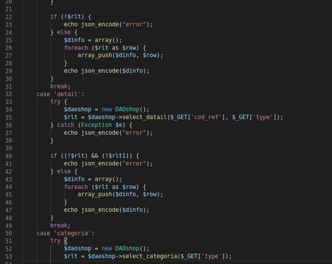
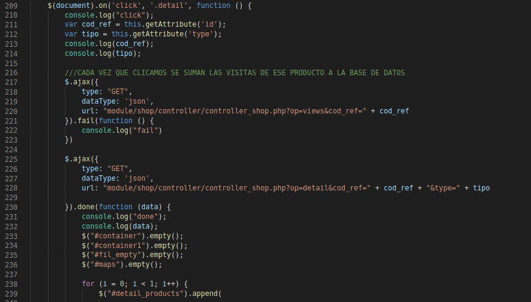
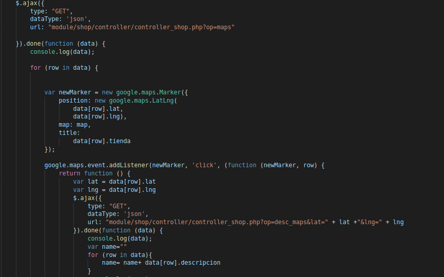
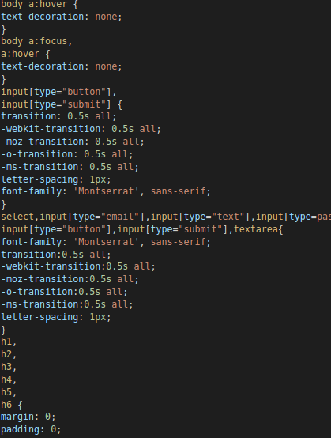

# PHP_OO_MVC_JQuery | LUXURY JEWELRY

<h2 align="center"> <strong>VICENT COLL BORREDA<strong></h2>

<h1 align="center" ##>About the project</h1>

This page, created in 1DAW as the first project, is inspired by an online store that sells jewelry with factory faults at low prices

<h1 align="center" ##>Building</h1>

* [PHP] - Backend  

  

* [JQuery] - Frontend  

  

* [JS] - Frontend 

  

* [Bootstrap] - CSS  

  

[PHP]: <http://php.net/>
 [jQuery]: <http://jquery.com>
 [js]: <https://es.wikipedia.org/wiki/JavaScript>
 [Bootstrap]: <https://getbootstrap.com/>

<h1 align="center" ##>Features</h1>

| Page | Features |
|---------|-------------|
| Home | Porduct-Detail, Type-Shop, View more|
| Shop | List, Details, Details-Related, Filters,Filter-Order By, Maps, Products in map (M-M), Maps-Details |
| Products list |  Modal, Delete All, CRUD, JS/PHP validation|
| Products view | Datatable, Product information |
| Contact | Maps-Stores, InfoWindow, Marker, |

<h1 align="center" ##>Whole web</h1>

* Carrousel, Carrousel-Shop
* Languages
* Check visited, Order by Visited
* All combinations search 
* All pages with controller and top pages